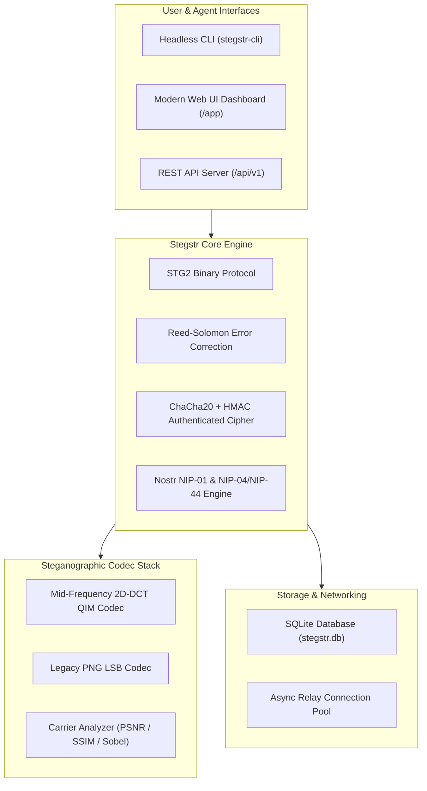

# Stegstr — Architecture Guidelines & Mobile Integration Blueprint

> **Latest Implementation Reference & Future Roadmap**  
> *Version:* `1.0.0_ROBUST_DCT`  
> *Author:* Autonomous AI Coding Agent (Stegstr Architecture Team)

---

## Table of Contents
1. [System Architecture & Component Overview](#1-system-architecture--component-overview)
2. [Core Steganographic Engine & Robustness Strategy](#2-core-steganographic-engine--robustness-strategy)
3. [Networking, Nostr Protocol & Persistence](#3-networking-nostr-protocol--persistence)
4. [AI Agent Operability & Headless Automation](#4-ai-agent-operability--headless-automation)
5. [Deployment & Containerization Guidelines](#5-deployment--containerization-guidelines)
6. [Mobile Application Integration Blueprint (iOS & Android)](#6-mobile-application-integration-blueprint-ios--android)

---

## 1. System Architecture & Component Overview

Stegstr is an open-source, robust steganographic communication framework and Nostr client designed to hide encrypted micro-blogging notes and direct messages inside standard JPEG, PNG, and WebP media files.



---

## 2. Core Steganographic Engine & Robustness Strategy

### 2.1 Mid-Frequency 2D-DCT Quantization Index Modulation (QIM)
To survive aggressive real-world social media compression pipelines (WhatsApp, Telegram, Instagram), Stegstr embeds data into the **luminance ($Y$) channel AC coefficients** using $8 \times 8$ Discrete Cosine Transform (DCT) blocks:

$$\text{Quantization Decision Boundary: } Q = \Delta \cdot \text{round}\left(\frac{C}{\Delta}\right) + \text{bit} \cdot \frac{\Delta}{2}$$

- **Quantization Step Size ($\Delta$)**: Default $\Delta = 32.0$ (or $48.0$ for `robust` mode). This allows bit decision boundaries to easily overcome round-off errors introduced by integer RGB conversions.
- **Barker-13 Synchronization Sequence**: Payload fragments are bounded by 13-bit Barker sync sequences (`1111100110101`) to allow exact frame alignment even if spatial dimensions or headers are stripped.

### 2.2 Reed-Solomon Forward Error Correction (FEC) & Matrix Interleaving
- **Redundancy Profiles**:
  - `fast`: 14% redundancy
  - `balanced`: 33% redundancy (recommended for social media)
  - `robust`: 60% redundancy (heavy compression survival)
  - `maximum`: 100% parity ratio
- **Byte Interleaving**: Matrix permutation scatters contiguous payload bytes across distant DCT blocks, preventing localized image cropping or compression artifacts from destroying a whole block of data.

---

## 3. Networking, Nostr Protocol & Persistence

- **Nostr BIP-340 Schnorr Signatures**: Pure Python secp256k1 implementation satisfying even-$Y$ coordinate point normalization.
- **NIP-04 / NIP-44 Encrypted DMs**: Elliptic Curve Diffie-Hellman (ECDH) key agreement combined with ChaCha20-Poly1305 stream cipher.
- **Relay Manager**: Asynchronous WebSocket connection pool with auto-reconnect, exponential backoff, and event deduplication.
- **SQLite Persistence**: Local storage at `data/stegstr.db` for identity keys, timeline notes, relays, and offline outbound queue.

---

## 4. AI Agent Operability & Headless Automation

All `stegstr-cli` commands support machine-readable `--json` output:

```bash
# Encoded carrier output
./stegstr-cli encode carrier.jpg -m "Secret Payload" -o stego.jpg --json

# Decoded carrier payload
./stegstr-cli decode stego.jpg --json

# Batch detection scanner
./stegstr-cli detect ./images/ --json
```

Automated discovery schemas are maintained in [`agents.txt`](file:///Users/mtarekrahman/Desktop/FreeLance/agents.txt) and [`AGENTS.md`](file:///Users/mtarekrahman/Desktop/FreeLance/AGENTS.md).

---

## 5. Deployment & Containerization Guidelines

### 5.1 Docker Compose Execution
The application is fully containerized with `Dockerfile` and `docker-compose.yml`:

```bash
# Build and run background daemon
docker compose up -d --build

# View container logs
docker compose logs -f

# Run test suite inside container
docker exec stegstr-service ./scripts/test.sh
```

### 5.2 Helper Scripts
- [`./scripts/dev.sh`](file:///Users/mtarekrahman/Desktop/FreeLance/scripts/dev.sh): Starts local Uvicorn dev server on `http://127.0.0.1:8765`.
- [`./scripts/test.sh`](file:///Users/mtarekrahman/Desktop/FreeLance/scripts/test.sh): Runs complete 16/16 test suite.
- [`./scripts/benchmark.sh`](file:///Users/mtarekrahman/Desktop/FreeLance/scripts/benchmark.sh): Executes automated media transformation benchmark suite.

---

## 6. Mobile Application Integration Blueprint (iOS & Android)

To bring Stegstr to mobile platforms (React Native, Flutter, Swift/iOS, Kotlin/Android), follow this architectural blueprint:

```
┌─────────────────────────────────────────────────────────────┐
│                    MOBILE APP FRONTEND                      │
│        (React Native / Flutter / Native Swift & Kotlin)      │
├──────────────────────────────┬──────────────────────────────┤
│    Camera & Gallery Picker   │    Encrypted Chat & Feed UI  │
└──────────────┬──────────────┴──────────────┬────────────────┘
               │                             │
               ▼                             ▼
┌─────────────────────────────────────────────────────────────┐
│             MOBILE HARDWARE SECURITY & CRYPTO LAYER         │
│     - iOS Keychain / Android KeyStore Encrypted nsec         │
│     - Biometric FaceID / TouchID / Fingerprint Auth         │
└──────────────┬──────────────────────────────────────────────┘
               │
               ▼
┌─────────────────────────────────────────────────────────────┐
│                 NATIVE STEGSTR CORE ENGINE                  │
│   Option A: Shared C/C++ Core via FFI (libstegstr.so/.dylib)│
│   Option B: Local Embedded REST API Sidecar (Port 8765)      │
└─────────────────────────────────────────────────────────────┘
```

### 6.1 Native Architecture Options

#### Option A: C/C++ Shared Library via FFI (Highest Performance)
- Compile the 2D-DCT algorithm and Reed-Solomon FEC into a lightweight native C/C++ library (`libstegstr.so` for Android, `libstegstr.dylib` / `.framework` for iOS).
- Use **dart:ffi** (Flutter) or **JNI / Swift C-interop** (React Native / Native) to call embedding/extraction at 60 FPS directly on raw camera frame buffers.

#### Option B: Embedded REST API Sidecar (Quickest Implementation)
- Package the Python engine or Go/C++ port as a background daemon process running on `http://127.0.0.1:8765` inside the mobile container.
- The mobile app makes standard HTTP `fetch()` calls to `/api/v1/encode`, `/api/v1/decode`, and `/api/v1/messages`.

### 6.2 Key Mobile Features & User Workflows

1. **Steganographic Camera & Instant Share**:
   - User takes a photo inside the app.
   - App automatically embeds their latest Nostr note or encrypted DM into the photo before saving to the camera roll.
   - One-click native share sheet to send directly to WhatsApp, Telegram, Instagram, or Signal.

2. **Background Gallery Detection Scanner**:
   - Background worker (iOS BackgroundTasks / Android WorkManager) scans incoming photos saved to the photo library.
   - If a `STG2` magic header is detected, the app extracts the secret message and posts a local encrypted push notification:  
     *“📩 Secret Stegstr payload extracted from incoming photo!”*

3. **Hardware Security & Biometric Protection**:
   - Store Nostr `nsec` private keys inside the **iOS Keychain** or **Android KeyStore** using hardware-backed Secure Enclave.
   - Require **FaceID / TouchID / Biometric Prompt** before revealing decrypted Kind 4 DMs or executing BIP-340 signatures.

4. **Media Compression Guard**:
   - When sharing images via native share sheets, mobile OSs often attempt auto-compression.
   - Implement pre-scaling to standard dimensions (e.g., $1024 \times 1024$) before embedding to ensure mid-frequency DCT coefficients remain untouched during platform transit.
